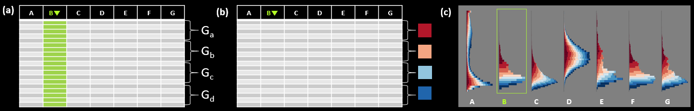
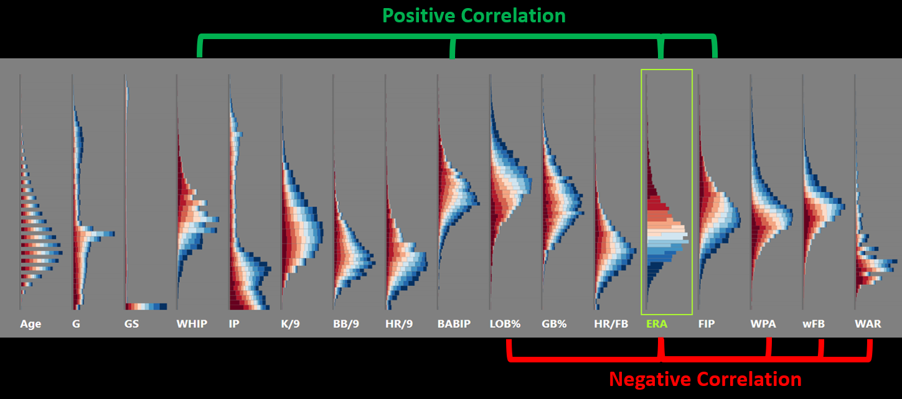

# Parallel Histogram Plot

:book: [Full Paper](https://ieeexplore.ieee.org/stamp/stamp.jsp?tp=&arnumber=9262081) :scroll: [Poster](http://hcil.snu.ac.kr/system/publications/pdfs/000/000/122/original/final2.pdf?1540239578)

Repository for
[Augmenting Parallel Coordinates Plots with Color-coded Stacked Histograms](https://ieeexplore.ieee.org/abstract/document/9262081) 

## Overview
------



Parallel Histogram Plot (PHP) is a technique that overcomes the innate limitations of parallel coordinates plot (PCP) by attaching stacked-bar histograms with discrete color schemes to PCP. From the color-coded histograms, users are able to see an overview of the whole data without cluttering or scalability issues. Following the Visual Information Seeking Mantra, the polylines of the original PCP can be used to show details of a small number of selected items when the cluttering problem subsides.
    


Each rectangle in the PHP histograms is color coded according to the data ranking by a selected attribute. 

**(a)** We first order the data items by a user-selected attribute and split the data items into groups according to the order while ensuring that each group has a similar number of items. 

**(b)** We represent each group as a bar and assign a unique color to each group. The colors are sampled from a diverging color scheme, to emphasize low- and high-ranked groups.

**(c)** We then build histograms by stacking color-coded bars, with each bar representing a group. 




The color-coding scheme allows users to visually examine relationships between attributes, even between those that are displayed far apart, without repositioning or reordering axes. For example, correlation between the selected(pivot) attribute and all the other attributes can be derived by comparing the color distributions of the corresponding histograms.

## Code
------
To be updated.

## Demo
------

https://bokjinwook.github.io/ParallelHistogramPlotDemo/

## Citation
-------

```bib
@ARTICLE{bok2020augmenting,
  author={Bok, Jinwook and Kim, Bohyoung and Seo, Jinwook},
  journal={IEEE Transactions on Visualization and Computer Graphics}, 
  title={Augmenting Parallel Coordinates Plots with Color-coded Stacked Histograms}, 
  year={2020},
  volume={},
  number={},
  pages={1-1},
  doi={10.1109/TVCG.2020.3038446}
}
```

## Contact
-------
bok@hcil.snu.ac.kr

## Updates
-------
210809 Added Overview

210805 Initial Commit

